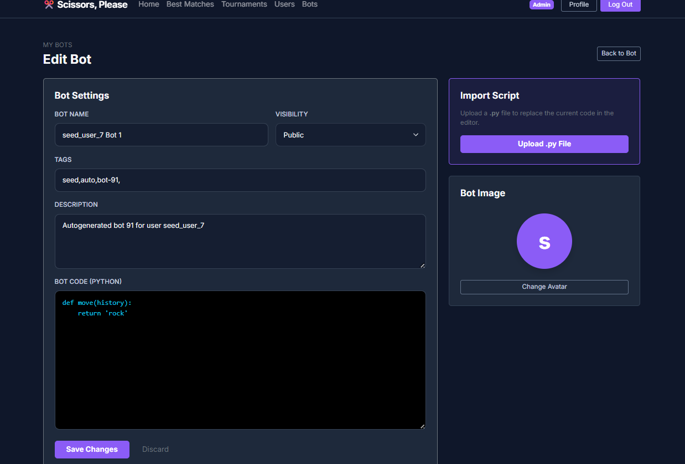
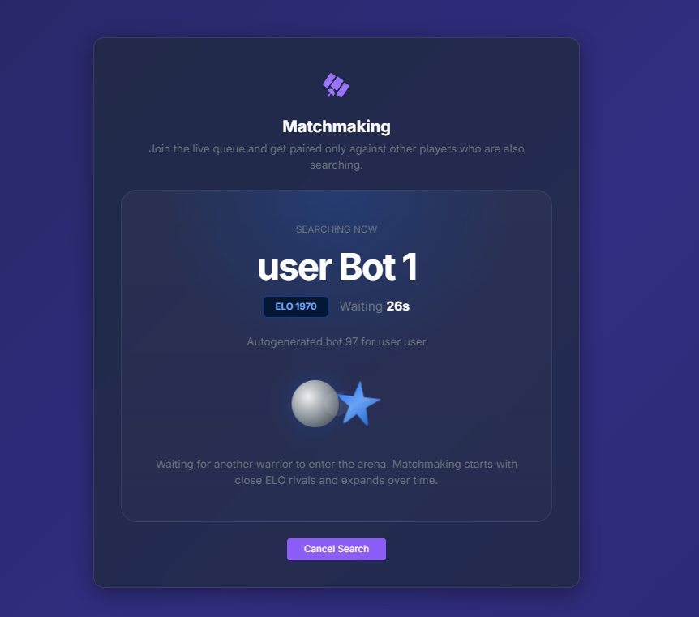
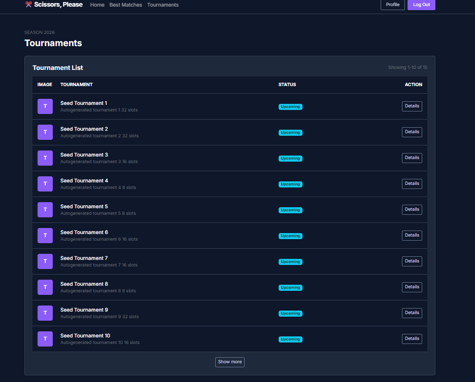
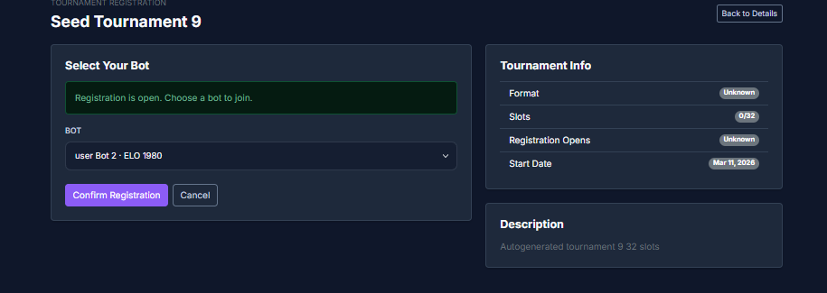
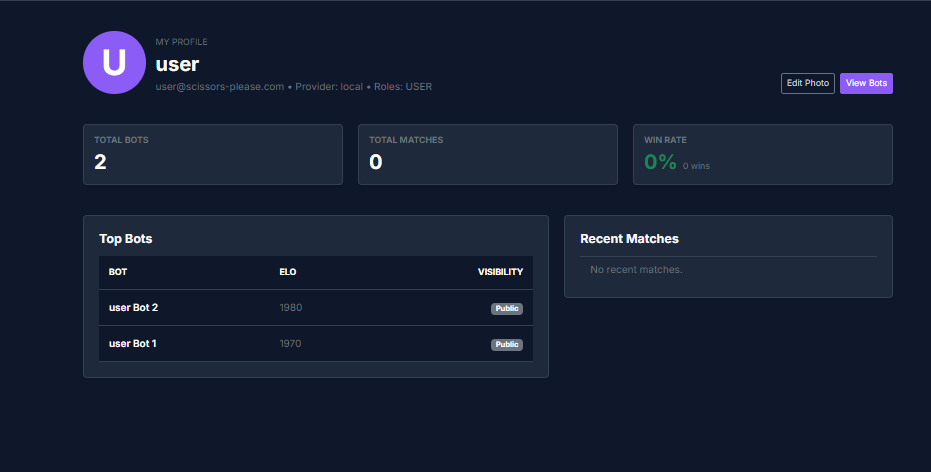
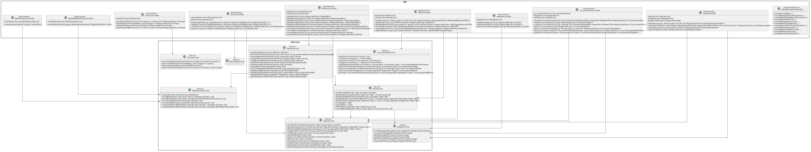
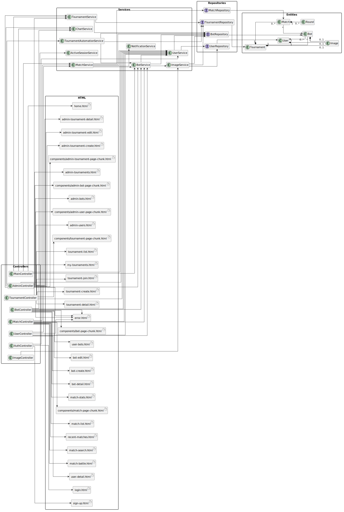

# Scissors, Please

## 👥 Miembros del Equipo
| Nombre y Apellidos                | Correo URJC                          | Usuario GitHub                                         |
|:---                               |:---                                  |:---                                                    |
| Jorge Cimadevilla Aniz            | j.cimadevilla.2022@alumnos.urjc.es   | [Lamoara](https://github.com/lamoara)                  |
| Marcelo Atanasio Domínguez Mateo  | ma.dominguez.2022@alumnos.urjc.es    | [Sa4dUs](https://github.com/sa4dus)                    |
| Alejandro García Prada            | a.garciap.2022@alumnos.urjc.es       | [AlexGarciaPrada](https://github.com/AlexGarciaPrada)  |

---

## 🎭 **Preparación 1: Definición del Proyecto**

### **Descripción del Tema**
La aplicación web tiene como objetivo permitir a los usuarios subir bots del juego Piedra, papel o tijera y combatir contra los de otros usuarios.
Esta aplicación también permite a los usuarios practicar algoritmia en un entorno real.

### **Entidades**
Indicar las entidades principales que gestionará la aplicación y las relaciones entre ellas:

1. **Usuario**
2. **Bot**
3. **Partida**
4. **Torneo**

**Relaciones entre entidades:**
- Usuario - Bot: Un usuario puede tener mútiples bots en juego (1:N)
- Partida - Bot: Una partida está compuesta por dos bots (1:N)
- Torneo - Bot: Un torneo está compuesto por varios bots (1:N)
- Torneo - Partida: En un torneo transcurren una serie de partidas (1:N)

### **Permisos de los Usuarios**
Describir los permisos de cada tipo de usuario e indicar de qué entidades es dueño:

* **Usuario Anónimo**: 
  - Permisos: visualizar partidas y torneos en juego, rankings por elo. 
  - No es dueño de ninguna entidad.

* **Usuario Registrado**: 
  - Permisos: Gestión de perfil, crear, eliminar y editar bots, participar en partidas y torneos.
  - Es dueño de: Sus bots y datos personales.

* **Administrador**: 
  - Permisos: Crear, eliminar y editar torneos. Gestionar usuarios.

### **Imágenes**
Indicar qué entidades tendrán asociadas una o varias imágenes:

- **Usuario**: Una imagen de avatar por usuario.
- **Bot**: Una imagen para el bot.
- **Torneo**: Una imagen que representa al torneo.

### **Gráficos**
Indicar qué información se mostrará usando gráficos y de qué tipo serán:

- **Resultados**: Gráfico circular que indica las victorias, derrotas y empates de cada bot y usuario. 
- **Progresión de ELO**: Gráfico de líneas que indica la progresión del ELO de un bot.
- **Usuarios registrados**: Histograma que indica el número de usuarios registrados cada mes.
- **Estadísticas de uso**: Gráfico circular con las opciones más jugadas a lo largo de un torneo.

### **Tecnología Complementaria**
Indicar qué tecnología complementaria se empleará:

- Sistema de autenticación con OAuth2.
- Intérpretar código en python en el servidor.
- Notificaciones en tiempo real con WebSockets.

### **Algoritmo o Consulta Avanzada**
Indicar cuál será el algoritmo o consulta avanzada que se implementará:

- **Algoritmo de emparejamiento**: algoritmo de emparejamiento en tiempo real.
- **Ranking**: se mostrará una clasificación de los bots por elo.
- **Bots destacados**: a partir de varias estadísticas, se calculará una serie de bots relevantes.

---

## 🛠 **Preparación 2: Maquetación de páginas con HTML y CSS**

### **Vídeo de Demostración**
📹 **[Enlace al vídeo en YouTube](https://www.youtube.com/watch?v=SnyTBY28ct4)**
> Vídeo mostrando las principales funcionalidades de la aplicación web.

### **Diagrama de Navegación**
Diagramas que muestran cómo se navega entre las diferentes páginas de la aplicación:

#### **Navegación Anónima**


#### **Navegación Usuario Autenticado**


#### **Navegación Administrador**


#### **Relación Entre Paquetes**


> La navegación está separada en tres paquetes (anónimo, autenticado y admin) con sus rutas específicas y puntos de transición.

### **Capturas de Pantalla y Descripción de Páginas**

#### **1. index.html**


> Esta es la página principal que se muestra a los usuarios cuando acceden a la aplicación sin haber iniciado sesión. Presenta una vista general de la plataforma y ofrece opciones para iniciar sesión o registrarse, actuando como punto de entrada público a la web.

#### **2. home-auth.html**


> Esta es la página Home que se muestra a los usuarios autenticados. Se presentan datos personalizados, como los bots del usuario, estadísticas relevantes y un listado de los últimos torneos en los que ha participado, proporcionando una visión general de su actividad dentro de la plataforma.

#### **3. home-admin.html**


> Esta es la página principal del administrador. Su diseño es similar al de la página pública, pero adaptada al rol de administrador, sustituyendo los botones de registro e inicio de sesión por una opción para cerrar sesión. Desde aquí el administrador puede navegar hacia las secciones de gestión.

---

### **Autenticación / Auth**

#### **4. login.html**


> Esta es la página de inicio de sesión de los usuarios. Permite acceder a la plataforma introduciendo las credenciales de la cuenta y ofrece opciones adicionales como iniciar sesión con Google (previsto para futuras prácticas), navegar a la página de registro o iniciar sesión como administrador.

#### **5. sign-up.html**


> Esta es la página de registro para nuevos usuarios. Contiene un formulario con los campos necesarios para crear una cuenta (correo electrónico, nombre de usuario, contraseña y confirmación de contraseña). También incluye un enlace directo a la página de login para usuarios que ya disponen de una cuenta.

---

### **Bots**

#### **6. bot-create.html**


> Esta es la página destinada a la creación de bots por parte del usuario. Se presenta como un formulario donde se pueden definir las características del bot y se incluyen opciones para importar el código del bot desde archivos en Python o JavaScript.

#### **7. bot-detail.html**


> Esta página muestra los detalles de un bot cuando el usuario no está autenticado. Permite consultar información básica y estadísticas del bot. Existen versiones análogas para usuarios autenticados y administradores, diferenciándose principalmente en las opciones de navegación y botones disponibles.

#### **8. bot-detail-admin.html**


> Esta es la versión de la página de detalles del bot para el administrador. Ofrece la misma información general del bot, pero con opciones adicionales de navegación y control propias del rol administrativo.

#### **9. bot-edit.html**


> Esta es la página que permite a un usuario autenticado modificar las propiedades de su bot. Desde aquí puede editar sus parámetros y realizar pruebas mediante test matches para evaluar su rendimiento antes de competir en torneos.

#### **10. my-bots.html**


> Esta es la página de “Mis Bots” para usuarios autenticados. Permite consultar todos los bots creados por el usuario, mostrando su nombre, estrategia, ELO y etiquetas de características. Incluye botones para ver o editar cada bot, así como opciones rápidas para crear un nuevo bot, importar bots existentes o filtrar la lista. En un panel lateral se presenta un resumen con estadísticas del usuario, como el total de bots y el ELO más alto, junto con accesos directos a acciones frecuentes, como abrir el bot más reciente o ver partidas recientes.

---

### **Torneos / Tournaments**

#### **11. admin-tournament-create-admin.html**


> Esta es la página destinada a la creación de torneos por parte del administrador. Se compone de un formulario donde se introducen los datos principales del torneo, como título, número máximo de jugadores, fechas, formato y descripción. También permite añadir información opcional como premio e imagen representativa mediante un modal de subida de archivos.

#### **12. admin-tournament-detail-admin.html**


> Esta página muestra la información detallada de un torneo desde el punto de vista del administrador. Incluye un resumen con el estado del torneo, fechas clave, número de participantes y formato de competición, además de acciones administrativas y tabla con los bots participantes.

#### **13. admin-tournament-edit-admin.html**


> Página utilizada por el administrador para modificar la configuración de un torneo existente. Se pueden cambiar parámetros como fecha de inicio, número máximo de jugadores, estado del torneo y añadir notas internas. Incluye opciones para guardar cambios o resetear campos.

#### **14. tournament-create.html**


> Página de creación de torneos accesible desde la vista pública. No permite crear torneos directamente, muestra un mensaje indicando que esta funcionalidad es exclusiva del panel de administración e incluye accesos rápidos para iniciar sesión.

#### **15. tournament-detail-auth.html**


> Muestra información completa del torneo, incluyendo fechas, premio, formato, número de plazas y organizador, además de descripción y reglas. La inscripción está cerrada y el botón correspondiente aparece deshabilitado.

#### **16. tournament-detail-open-auth.html**


> Muestra la información principal del torneo con inscripciones activas. Incluye descripción, reglas y un botón para unirse al torneo, además de otro para regresar a la lista.

#### **17. tournament-detail-open.html**


> Versión pública de la página de detalles de un torneo abierto, accesible sin autenticación. Permite consultar información pero restringe la acción de inscripción.

#### **18. tournament-detail.html**


> Página pública de detalles de un torneo cuyo periodo de inscripción aún no está abierto o está cerrado. La acción de registro aparece deshabilitada.

#### **19. tournament-join.html**


> Permite seleccionar un bot del usuario para participar en el torneo, añadir nota opcional y aceptar reglas. Muestra resumen del torneo y recompensas, con botones para confirmar o cancelar la inscripción.

#### **20. tournament-list-auth.html**


> Presenta los torneos organizados por categorías según su estado: abiertos, en progreso, próximos y finalizados. Incluye enlaces a detalles y acciones según el estado del torneo.

#### **21. tournament-list.html**


> Versión pública del listado de torneos, accesible sin autenticación, con restricciones en acciones y redirecciones a páginas informativas o de login cuando se requiere.

#### **22. tournament-result-auth.html**


> Presenta resumen del torneo finalizado, ganador, premio, tabla de resultados, ranking Top 8 y gráficos de uso de movimientos. Incluye opciones de descarga de informes.

#### **23. tournament-results.html**


> Versión pública de la página de resultados del torneo, con la misma información visual y estadísticas que la versión autenticada.

#### **24. my-tournaments-auth.html**


> Lista los torneos en los que el usuario está registrado o ha participado, con filtros, búsqueda y enlaces a detalles o resultados finales. Muestra resumen visual con badges y botones de acción contextualizados.


### **Partidas / Matches**

#### **25. match-battle.html**


> Página que representa el estado de una partida en curso entre dos bots, con nombres, identificadores gráficos, indicador “VS” y spinner de carga. Incluye botón para acceder a resultados.

#### **26. match-list-admin.html**


> Tabla con mejores enfrentamientos, criterios temporales, identificador de partida, bots, ELO máximo, resultado y fecha. Permite visualizar detalles y cuenta con paginación.

#### **27. match-list-auth.html**


> Similar a la versión administrativa, con tabla de información básica y filtros temporales. Permite acceder a estadísticas detalladas de cada partida y paginación.

#### **28. match-list.html**


> Tabla informativa de enfrentamientos destacados accesible sin autenticación, con paginación y filtros temporales.

#### **29. match-search.html**


> Página que indica que el sistema está buscando un oponente adecuado, mostrando indicador visual de carga y opciones para cancelar o forzar inicio de partida.

#### **30. match-stats.html**


> Muestra información detallada de un combate entre dos bots, incluyendo marcador final, ELO, cronología de rondas y gráficos. No permite acciones de usuario como rematch.

#### **31. match-stats-auth.html**


> Contiene la misma información que la versión pública, con funcionalidades adicionales como botón de “Rematch” y enlaces a perfiles de los bots.

#### **32. match-stats-admin.html**


> Incluye toda la información visual y analítica de la partida, adaptada a administrador con controles de navegación y gestión.

#### **33. recent-matches.html**


> Listado de últimos enfrentamientos del usuario, con ID, bots, resultado, fecha y acceso a estadísticas detalladas. Incluye filtros por tipo de resultado.

---

### **Perfil de Usuario / User Details**

#### **34. user-detail-auth.html**


> Muestra datos personales, estadísticas generales, Top Bots y actividad reciente. Permite actualizar foto de perfil y navegar a otras secciones.

#### **35. user-detail-from-bot-auth.html**


> Similar a la página de perfil propio, pero muestra información de otro usuario desde la vista de un bot, con opción de volver al detalle del bot.

#### **36. user-detail-from-bot-admin.html**


> Versión para administrador cuando accede desde la vista de un bot. Incluye navegación adaptada al rol y controles administrativos.

#### **37. user-detail.html**


> Versión pública del perfil de usuario, accesible sin autenticación. Muestra información básica, Top Bots y actividad reciente, sin posibilidad de edición ni acciones administrativas.


## 🛠 **Práctica 1: Web con HTML generado en servidor y AJAX**

### **Vídeo de Demostración**
📹 **[Enlace al vídeo en YouTube](https://youtu.be/DMxjXKgLYIQ)**
> Vídeo mostrando las principales funcionalidades de la aplicación web.

### **Navegación y Capturas de Pantalla**

#### **Diagrama de Navegación**

Diagrama actualizado de navegación de la aplicación para la Práctica 1:


> Este diagrama resume los principales flujos entre páginas públicas, de usuario autenticado y de administración, incluyendo los recorridos de matchmaking, gestión de bots y torneos.

#### **Capturas de Pantalla Actualizadas**
Algunas de las capturas que han cambiado son las siguientes:
#### **1. bot-edit.html**


#### **2. match-battle.html**


#### **3. my-tournaments-auth.html**


#### **4. tournament-join.html**



#### **5. user-detail-auth.html**


### **Instrucciones de Ejecución**

#### **Requisitos Previos**
- **Java**: versión 21 o superior
- **Maven**: versión 3.8 o superior
- **MySQL**: versión 8.0 o superior
- **Git**: para clonar el repositorio

#### **Pasos para ejecutar la aplicación**

1. **Clonar el repositorio**
   ```bash
   git clone --depth 1 https://github.com/CodeURJC-DAW-2025-26/practica-daw-2025-26-grupo-12
   cd practica-daw-2025-26-grupo-12
   ```

2. **Configurar las variables de entorno**
   - Crear un archivo `.env` en la raíz del proyecto a partir de `.env.example`.
   - Revisar ese archivo y ajustar, si es necesario, la conexión a MySQL y la contraseña del keystore SSL.

3. **Generar el keystore para HTTPS**
   ```bash
   chmod +x src/main/resources/generate-keystore.sh
   ./src/main/resources/generate-keystore.sh
   ```
   Este script genera el archivo `src/main/resources/keystore.p12`. Si ya existe, no lo sobrescribe.

4. **Crear la base de datos en MySQL**
   - Crear una base de datos vacía llamada `scissors_please`.
   - Verificar que las credenciales configuradas en `.env` tienen acceso a esa base de datos.

5. **Compilar e iniciar la aplicación**
   - La aplicación debe arrancarse con los perfiles `mysql` y `https` activos para usar MySQL como base de datos y habilitar el certificado generado.
   ```bash
   ./mvnw clean install
   ./mvnw spring-boot:run -Dspring-boot.run.profiles=mysql,https
   ```

6. **Acceder a la aplicación**
   - Aplicación: `https://localhost:8443`
   - Redirección HTTP: `http://localhost:8080`

#### **Credenciales de prueba**
- **Usuario Admin**: usuario: `admin`, contraseña: `admin123`
- **Usuario Registrado**: usuario: `user`, contraseña: `user123`

### **Diagrama de Entidades de Base de Datos**

Diagrama mostrando las entidades, sus campos y relaciones:


> El diagrama refleja las entidades persistentes principales de la aplicación (`User`, `Bot`, `Tournament`, `Match`, `Round` e `Image`), junto con sus relaciones y tablas auxiliares generadas por JPA.

### **Diagrama de Clases y Templates**

Diagrama de clases de la aplicación con diferenciación por colores o secciones:


> El diagrama organiza la aplicación por capas (`Presentación`, `Lógica de Negocio`, `Persistencia`, `Dominio` e `Infraestructura`) y muestra las dependencias principales entre controladores, servicios, repositorios y entidades.

### **Participación de Miembros en la Práctica 1**

#### **Alumno 1 - Jorge Cimadevilla Aniz**

Principalmente me he encargado de la arquitectura funcional de la aplicación en la parte de torneos, matchmaking y administración, además de la configuración HTTPS y la documentación visual del proyecto. También he trabajado en filtros dinámicos del panel de administración, automatización de torneos y flujos completos de inscripción y revancha.

| Nº    | Commits      | Files      |
|:------------: |:------------:| :------------:|
|1| [Proper https config with automatic redirect (https profile)](https://github.com/CodeURJC-DAW-2025-26/practica-daw-2025-26-grupo-12/commit/279b18e)  | [HttpsRedirectConfig.java](https://github.com/CodeURJC-DAW-2025-26/practica-daw-2025-26-grupo-12/blob/main/src/main/java/es/codeurjc/grupo12/scissors_please/config/HttpsRedirectConfig.java)   |
|2| [Admin users panel with live filters](https://github.com/CodeURJC-DAW-2025-26/practica-daw-2025-26-grupo-12/commit/86191fd)  | [AdminController.java](https://github.com/CodeURJC-DAW-2025-26/practica-daw-2025-26-grupo-12/blob/main/src/main/java/es/codeurjc/grupo12/scissors_please/controller/web/AdminController.java)   |
|3| [Automate tournament execution daily](https://github.com/CodeURJC-DAW-2025-26/practica-daw-2025-26-grupo-12/commit/6dbd154)  | [TournamentAutomationService.java](https://github.com/CodeURJC-DAW-2025-26/practica-daw-2025-26-grupo-12/blob/main/src/main/java/es/codeurjc/grupo12/scissors_please/service/TournamentAutomationService.java)   |
|4| [Tournament registration flow](https://github.com/CodeURJC-DAW-2025-26/practica-daw-2025-26-grupo-12/commit/72d27d0)  | [TournamentService.java](https://github.com/CodeURJC-DAW-2025-26/practica-daw-2025-26-grupo-12/blob/main/src/main/java/es/codeurjc/grupo12/scissors_please/service/TournamentService.java)   |
|5| [Matchmaking queue and rematch flow](https://github.com/CodeURJC-DAW-2025-26/practica-daw-2025-26-grupo-12/commit/2814ebf)  | [MatchService.java](https://github.com/CodeURJC-DAW-2025-26/practica-daw-2025-26-grupo-12/blob/main/src/main/java/es/codeurjc/grupo12/scissors_please/service/MatchService.java)   |

---

#### **Alumno 2 - Marcelo Atanasio Domínguez Mateo**

Principalmente me he encargado de la parte de autenticación, tanto por credenciales como su integración por OAuth. También he implementado el sistema de notificación en tiempo real, el borrado de bots y torneos, la implementación de algoritmos avanzados como el de ELO y partidas destacadas. Además, también he participado trasversalmente a lo largo de todo el proyecto en corrección de errores y mejoras generales. 

| Nº    | Commits      | Files      |
|:------------: |:------------:| :------------:|
|1| [Implement credential based authentication](https://github.com/CodeURJC-DAW-2025-26/practica-daw-2025-26-grupo-12/commit/184e5e3)  | [SecurityConfig.java](https://github.com/CodeURJC-DAW-2025-26/practica-daw-2025-26-grupo-12/blob/main/src/main/java/es/codeurjc/grupo12/scissors_please/security/SecurityConfig.java)   |
|2| [Add OAuth2.0 integration with Google Cloud](https://github.com/CodeURJC-DAW-2025-26/practica-daw-2025-26-grupo-12/commit/e3d73b1)  | [UserService.java](https://github.com/CodeURJC-DAW-2025-26/practica-daw-2025-26-grupo-12/blob/main/src/main/java/es/codeurjc/grupo12/scissors_please/service/UserService.java)   |
|3| [Create notification infra for rt updates](https://github.com/CodeURJC-DAW-2025-26/practica-daw-2025-26-grupo-12/commit/bb6c690)  | [CustomOAuth2UserService.java](https://github.com/CodeURJC-DAW-2025-26/practica-daw-2025-26-grupo-12/blob/main/src/main/java/es/codeurjc/grupo12/scissors_please/security/CustomOAuth2UserService.java)   |
|4| [Soft delete bots](https://github.com/CodeURJC-DAW-2025-26/practica-daw-2025-26-grupo-12/commit/852c80f)  | [NotificationService.java](https://github.com/CodeURJC-DAW-2025-26/practica-daw-2025-26-grupo-12/blob/main/src/main/java/es/codeurjc/grupo12/scissors_please/service/NotificationService.java)  |
|5| [Update elo post match](https://github.com/CodeURJC-DAW-2025-26/practica-daw-2025-26-grupo-12/commit/1d74d20a)  | [BotService.java](https://github.com/CodeURJC-DAW-2025-26/practica-daw-2025-26-grupo-12/blob/main/src/main/java/es/codeurjc/grupo12/scissors_please/service/BotService.java)   |

---

#### **Alumno 3 - Alejandro García Prada**
Me he encargado de la página de detalle de la mayoría de las entidades. Además me he encargado de algunos formularios, de las gráficas y de las páginas de error. Támbien me he encargado de la lógica de las imágenes.

| Nº    | Commits      | Files      |
|:------------: |:------------:| :------------:|
|1| [user statistics chart](https://github.com/CodeURJC-DAW-2025-26/practica-daw-2025-26-grupo-12/commit/b288c0c)  | [CharService.java](https://github.com/CodeURJC-DAW-2025-26/practica-daw-2025-26-grupo-12/blob/main/src/main/java/es/codeurjc/grupo12/scissors_please/service/ChartService.java)   |
|2| [Tournament images](https://github.com/CodeURJC-DAW-2025-26/practica-daw-2025-26-grupo-12/commit/5092dbe)  | [AdminController.java](https://github.com/CodeURJC-DAW-2025-26/practica-daw-2025-26-grupo-12/blob/main/src/main/java/es/codeurjc/grupo12/scissors_please/controller/AdminController.java)   |
|3| [Import.py](https://github.com/CodeURJC-DAW-2025-26/practica-daw-2025-26-grupo-12/commit/9e9e075950119122ab2183bdf9c44dcaa13925d4)  | [bot-edit.html](src/main/resources/templates/bot-edit.html)   |
|4| [charts](https://github.com/CodeURJC-DAW-2025-26/practica-daw-2025-26-grupo-12/commit/79619605f140bfffd3d1f541be2d4ac7849c0aa1)  | [ChartService.java](src/main/java/es/codeurjc/grupo12/scissors_please/service/ChartService.java)   |
|5| [bot edit](https://github.com/CodeURJC-DAW-2025-26/practica-daw-2025-26-grupo-12/commit/28bbbd283e66d73368c78a97bf5579011abbbdde)  | [BotController.java](src/main/java/es/codeurjc/grupo12/scissors_please/controller/web/BotController.java)   |

---

## 🛠 **Práctica 2: Incorporación de una API REST a la aplicación web, despliegue con Docker y despliegue remoto**

### **Vídeo de Demostración**
📹 **[Enlace al vídeo en YouTube](https://www.youtube.com/watch?v=x91MPoITQ3I)**
> Vídeo mostrando las principales funcionalidades de la aplicación web.

### **Documentación de la API REST**

#### **Especificación OpenAPI**
📄 **[Especificación OpenAPI (YAML)](/api-docs/api-docs.yaml)**

#### **Documentación HTML**
📖 **[Documentación API REST (HTML)](https://raw.githack.com/CodeURJC-DAW-2025-26/practica-daw-2025-26-grupo-12/main/api-docs/api-docs.html)**

> La documentación de la API REST se encuentra en la carpeta `/api-docs` del repositorio. Se ha generado automáticamente con SpringDoc a partir de las anotaciones en el código Java.

### **Diagrama de Clases**


Diagrama actualizado incluyendo los @RestController y su relación con los @Service compartidos:



### **Instrucciones de Ejecución con Docker**

#### **Requisitos previos:**
- Docker instalado (versión 20.10 o superior)
- Docker Compose instalado (versión 2.0 o superior)

#### **Pasos para ejecutar con docker-compose:**

1. **Clonar el repositorio** (si no lo has hecho ya):
   ```bash
   git clone https://github.com/CodeURJC-DAW-2025-26/practica-daw-2025-26-grupo-12
   cd practica-daw-2025-26-grupo-12
   ```

2. **AQUÍ LOS SIGUIENTES PASOS**:

### **Construcción de la Imagen Docker**

#### **Requisitos:**
- Docker instalado en el sistema

#### **Pasos para construir y publicar la imagen:**

```bash
./docker/create_image.sh <user>/scissors-please
./docker/publish_image.sh <user>/scissors-please
./docker/publish_docker-compose.sh <user>/scissors-please-compose <user>/scissors-please
```

2. **AQUÍ LOS SIGUIENTES PASOS**

### **Despliegue en Máquina Virtual**

#### **Requisitos:**
- Acceso a la máquina virtual (SSH)
- Clave privada para autenticación
- Conexión a la red correspondiente o VPN configurada

#### **Pasos para desplegar:**

1. **Conectar a la máquina virtual**:
   ```bash
   ssh -i [ruta/a/clave.key] [usuario]@[IP-o-dominio-VM]
   ```
   
   Ejemplo:
   ```bash
   ssh -i ssh-keys/app.key vmuser@10.100.139.XXX
   ```

2. **AQUÍ LOS SIGUIENTES PASOS**:

### **URL de la Aplicación Desplegada**

🌐 **URL de acceso**: `https://[nombre-app].etsii.urjc.es:8443`

#### **Credenciales de Usuarios de Ejemplo**

| Rol | Usuario | Contraseña |
|:---|:---|:---|
| Administrador | admin | admin123 |
| Usuario Registrado | user1 | user123 |
| Usuario Registrado | user2 | user123 |

### **Participación de Miembros en la Práctica 2**

#### **Alumno 1 - Alejandro García Prada**

Me he encargado de organizar algunos DTOs de respuestas, de implementar el JWT y de generar algunos endpoints

| Nº    | Commits      | Files      |
|:------------: |:------------:| :------------:|
|1| [Some improvements](https://github.com/CodeURJC-DAW-2025-26/practica-daw-2025-26-grupo-12/commit/4632666f764789c2f2975cf8915c653cdd4ccd44)  | [LoginController.java](‎backend/src/main/java/es/codeurjc/grupo12/scissors_please/controller/api/v1/auth/LoginController.java)   |
|2| [MatchDto and UserDto](https://github.com/CodeURJC-DAW-2025-26/practica-daw-2025-26-grupo-12/commit/8834e1e1cefa2cee4e5792aeb8b706612efa0c0d)  | [GlobalExceptionHandler.java‎](backend/src/main/java/es/codeurjc/grupo12/scissors_please/controller/api/v1/exceptions/GlobalExceptionHandler.java)   |
|3| [security config and chart fix](https://github.com/CodeURJC-DAW-2025-26/practica-daw-2025-26-grupo-12/commit/fa84d2d083aa1d337bb4ed85f46c10735638b642)  | [SecurityConfig.java](backend/src/main/java/es/codeurjc/grupo12/scissors_please/security/SecurityConfig.java)   |
|4| [Some more endpoints for admin actions](https://github.com/CodeURJC-DAW-2025-26/practica-daw-2025-26-grupo-12/commit/b85b7f2d81a6b0ab8d18aa943f165623e5ce698a)  | [UserController.java](backend/src/main/java/es/codeurjc/grupo12/scissors_please/controller/api/v1/user/UserController.java)   |
|5| [ChartController](https://github.com/CodeURJC-DAW-2025-26/practica-daw-2025-26-grupo-12/commit/cffb69fad55eb09128c88518dcd75b21e13161a7)  | [ChartController.java](backend/src/main/java/es/codeurjc/grupo12/scissors_please/controller/api/v1/chart/ChartController.java)   |

---

#### **Alumno 2 - Marcelo Atanasio Domínguez**

En esta fase, me he encargado principalmente de la parte de despliegue con Docker, asegurándome de que la aplicación sea fácil de desplegar de manera personalizable y consistente, así como con los datos de inicio adecuados según el modo. Además, he resuelto *bugs* relacionados con el `GlobalExceptionHandler` e implementado los controladores REST relativos a las notificaciones, partidas y torneos.

| Nº    | Commits      | Files      |
|:------------: |:------------:| :------------:|
|1| [Setup docker](https://github.com/CodeURJC-DAW-2025-26/practica-daw-2025-26-grupo-12/commit/64375ef60c50eda6ced956387875c230c8b0c33f)  | [docker/Dockerfile](https://github.com/CodeURJC-DAW-2025-26/practica-daw-2025-26-grupo-12/blob/main/docker/Dockerfile)   |
|2| [Deploy app with https on the server](https://github.com/CodeURJC-DAW-2025-26/practica-daw-2025-26-grupo-12/commit/5015fd0eb7bf686a70e3a444239d00455a7e4471)  | [docker/docker_compose.yml](https://github.com/CodeURJC-DAW-2025-26/practica-daw-2025-26-grupo-12/blob/main/docker/docker_compose.yml)   |
|3| [Add notifications and postman](https://github.com/CodeURJC-DAW-2025-26/practica-daw-2025-26-grupo-12/commit/11c264d864cdeeed6706ba93b86267021ea630a6)  | [backend/src/main/java/es/codeurjc/grupo12/scissors_please/controller/api/v1/notifications/AdminNotificationRestController.java](https://github.com/CodeURJC-DAW-2025-26/practica-daw-2025-26-grupo-12/blob/main/backend/src/main/java/es/codeurjc/grupo12/scissors_please/controller/api/v1/notifications/AdminNotificationRestController.java)   |
|4| [Add tournament join related endpoints](https://github.com/CodeURJC-DAW-2025-26/practica-daw-2025-26-grupo-12/commit/7b81cda620e73be18d08422a14a048fdb73a14dd)  | [backend/src/main/java/es/codeurjc/grupo12/scissors_please/controller/api/v1/tournaments/TournamentController.java](https://github.com/CodeURJC-DAW-2025-26/practica-daw-2025-26-grupo-12/blob/main/backend/src/main/java/es/codeurjc/grupo12/scissors_please/controller/api/v1/tournaments/TournamentController.java)   |
|5| [Add most match related REST endpoints](https://github.com/CodeURJC-DAW-2025-26/practica-daw-2025-26-grupo-12/commit/90379899d10b3d0aae77edf3b582b1155bc06721)  | [backend/src/main/java/es/codeurjc/grupo12/scissors_please/controller/api/v1/matches/MatchController.java](https://github.com/CodeURJC-DAW-2025-26/practica-daw-2025-26-grupo-12/blob/main/backend/src/main/java/es/codeurjc/grupo12/scissors_please/controller/api/v1/matches/MatchController.java)   |

---

#### **Alumno 3 - [Nombre Completo]**

[Descripción de las tareas y responsabilidades principales del alumno en el proyecto]

| Nº    | Commits      | Files      |
|:------------: |:------------:| :------------:|
|1| [Descripción commit 1](URL_commit_1)  | [Archivo1](URL_archivo_1)   |
|2| [Descripción commit 2](URL_commit_2)  | [Archivo2](URL_archivo_2)   |
|3| [Descripción commit 3](URL_commit_3)  | [Archivo3](URL_archivo_3)   |
|4| [Descripción commit 4](URL_commit_4)  | [Archivo4](URL_archivo_4)   |
|5| [Descripción commit 5](URL_commit_5)  | [Archivo5](URL_archivo_5)   |

---

## 🛠 **Práctica 3: Implementación de la web con arquitectura SPA**

### **Vídeo de Demostración**
📹 **[Enlace al vídeo en YouTube](URL_del_video)**
> Vídeo mostrando las principales funcionalidades de la aplicación web.

### **Preparación del Entorno de Desarrollo**

#### **Requisitos Previos**
- **Node.js**: versión 18.x o superior
- **npm**: versión 9.x o superior (se instala con Node.js)
- **Git**: para clonar el repositorio

#### **Pasos para configurar el entorno de desarrollo**

1. **Instalar Node.js y npm**
   
   Descarga e instala Node.js desde [https://nodejs.org/](https://nodejs.org/)
   
   Verifica la instalación:
   ```bash
   node --version
   npm --version
   ```

2. **Clonar el repositorio** (si no lo has hecho ya)
   ```bash
   git clone https://github.com/[usuario]/[nombre-repositorio].git
   cd [nombre-repositorio]
   ```

3. **Navegar a la carpeta del proyecto React**
   ```bash
   cd frontend
   ```

4. **AQUÍ LOS SIGUIENTES PASOS**

### **Diagrama de Clases y Templates de la SPA**

Diagrama mostrando los componentes React, hooks personalizados, servicios y sus relaciones:


### **Participación de Miembros en la Práctica 3**

#### **Alumno 1 - [Nombre Completo]**

[Descripción de las tareas y responsabilidades principales del alumno en el proyecto]

| Nº    | Commits      | Files      |
|:------------: |:------------:| :------------:|
|1| [Descripción commit 1](URL_commit_1)  | [Archivo1](URL_archivo_1)   |
|2| [Descripción commit 2](URL_commit_2)  | [Archivo2](URL_archivo_2)   |
|3| [Descripción commit 3](URL_commit_3)  | [Archivo3](URL_archivo_3)   |
|4| [Descripción commit 4](URL_commit_4)  | [Archivo4](URL_archivo_4)   |
|5| [Descripción commit 5](URL_commit_5)  | [Archivo5](URL_archivo_5)   |

---

#### **Alumno 2 - [Nombre Completo]**

[Descripción de las tareas y responsabilidades principales del alumno en el proyecto]

| Nº    | Commits      | Files      |
|:------------: |:------------:| :------------:|
|1| [Descripción commit 1](URL_commit_1)  | [Archivo1](URL_archivo_1)   |
|2| [Descripción commit 2](URL_commit_2)  | [Archivo2](URL_archivo_2)   |
|3| [Descripción commit 3](URL_commit_3)  | [Archivo3](URL_archivo_3)   |
|4| [Descripción commit 4](URL_commit_4)  | [Archivo4](URL_archivo_4)   |
|5| [Descripción commit 5](URL_commit_5)  | [Archivo5](URL_archivo_5)   |

---

#### **Alumno 3 - [Nombre Completo]**

[Descripción de las tareas y responsabilidades principales del alumno en el proyecto]

| Nº    | Commits      | Files      |
|:------------: |:------------:| :------------:|
|1| [Descripción commit 1](URL_commit_1)  | [Archivo1](URL_archivo_1)   |
|2| [Descripción commit 2](URL_commit_2)  | [Archivo2](URL_archivo_2)   |
|3| [Descripción commit 3](URL_commit_3)  | [Archivo3](URL_archivo_3)   |
|4| [Descripción commit 4](URL_commit_4)  | [Archivo4](URL_archivo_4)   |
|5| [Descripción commit 5](URL_commit_5)  | [Archivo5](URL_archivo_5)   |

---

#### **Alumno 4 - [Nombre Completo]**

[Descripción de las tareas y responsabilidades principales del alumno en el proyecto]

| Nº    | Commits      | Files      |
|:------------: |:------------:| :------------:|
|1| [Descripción commit 1](URL_commit_1)  | [Archivo1](URL_archivo_1)   |
|2| [Descripción commit 2](URL_commit_2)  | [Archivo2](URL_archivo_2)   |
|3| [Descripción commit 3](URL_commit_3)  | [Archivo3](URL_archivo_3)   |
|4| [Descripción commit 4](URL_commit_4)  | [Archivo4](URL_archivo_4)   |
|5| [Descripción commit 5](URL_commit_5)  | [Archivo5](URL_archivo_5)   |
